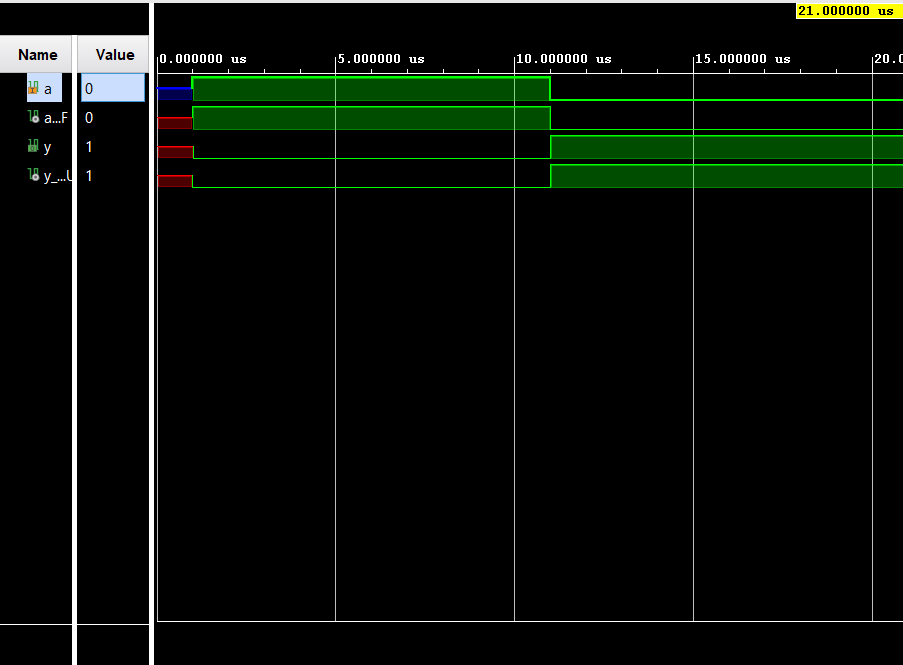

# Boolean Board Logic Gates Implementation

Implementations of basic logic gates using Verilog on the Real Digital Boolean Board.

## Contents
- [Project Overview](#project-overview)
- [Gates Implemented](#gates-implemented)
- [Setup Instructions](#setup-instructions)
- [Simulation Results](#simulation-results)
- [Implementation Details](#implementation-details)
- [License](#license)

## Gates Implemented
1. AND Gate
2. OR Gate
3. NOT Gate (Inverter)
4. NAND Gate
5. NOR Gate
6. XOR Gate
7. XNOR Gate
8. Buffer

## Setup Instructions
1. Clone this repository
2. Open project in Xilinx Vivado
3. Run simulation for testbenches
4. Generate bitstream and program Boolean Board

## Simulation Results

