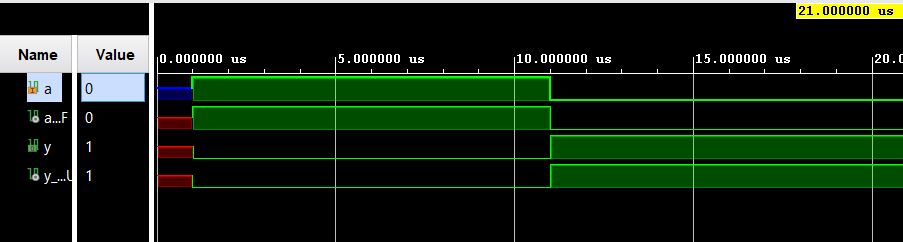

# Boolean Board Logic Gates Implementation

Implementations of basic logic gates using Verilog on the Real Digital Boolean Board.

## Contents
- [Project Overview](#project-overview)
- [Gates Implemented](#gates-implemented)
- [Setup Instructions](#setup-instructions)
- [Hardware](#hardware)
- [Simulation Results](#simulation-results)

## Project Overview

## Gates Implemented
1. NOT Gate (Inverter)
2. AND Gate
3. OR Gate
4. NAND Gate
5. NOR Gate
6. XOR Gate
7. XNOR Gate

## Setup Instructions
1. Clone this repository
2. Open project in Xilinx Vivado
3. Run simulation for testbenches
4. Generate bitstream and program Boolean Board

## Hardware

> **The Boolean Board by Real Digital**
([Reference Manual](https://www.realdigital.org/doc/02013cd17602c8af749f00561f88ae21))
## Simulation Results

> Output Waveform of [NOT Gate](NOT_Gate/src/not_gate.v)

